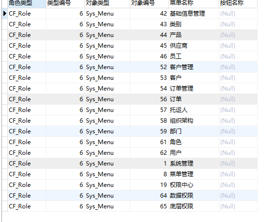
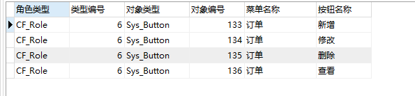

# RBAC权限管理
##查询用户test1可以查看的页面（Sys_menu）
select  MenuName,PrivilegeOperation  
from  cf_privilege  
inner join sys_menu on ( 
cf_privilege.PrivilegeAccessKey=sys_menu.MenuID  
and 
cf_privilege.PrivilegeAccess="sys_menu") 
 where ( 
 cf_privilege.PrivilegeMaster="CF_User"  
 and 
 cf_privilege.PrivilegeMasterKey=( 
 select UserID as i from cf_user where LoginName="test1"))  
 or 
(cf_privilege.PrivilegeMaster="CF_Role"  
and  
cf_privilege.PrivilegeMasterKey=( 
select RoleID  
from cf_userrole  
where UserID=( 
select UserID as i  
from cf_user  
where LoginName="test1")));  
  
1、根据名称查找人员编号UserID
2、根据人员编号UserID查找改人员所对应的角色集合RoleIDs
3、权限表innnr JOIN 页面表并查找,角色类型为CF_Role和，角色编号在角色集合RoleIDs中或者，角色类型为CF_User和，人员编号为UserID和，权限属性为Permit和，权限为Sys_Menu的数据

##查询用户test1对订单(order)页面中的操作权限(sys_button)
select  BtnName,MenuName,PrivilegeOperation 
from  cf_privilege  
inner join sys_button on ( 
cf_privilege.PrivilegeAccessKey=sys_button.BtnID  
and         
cf_privilege.PrivilegeAccess="Sys_Button") 
inner join sys_menu on sys_button.MenuNo=sys_menu.MenuNo 
where ( 
cf_privilege.PrivilegeMaster="CF_User"  
and  
cf_privilege.PrivilegeMasterKey=( 
select UserID as i  
from cf_user  
where LoginName="test1"))  
or 
(cf_privilege.PrivilegeMaster="CF_Role"  
and  
cf_privilege.PrivilegeMasterKey=( 
select RoleID from cf_userrole where UserID=( 
select UserID as i from cf_user where LoginName="test1")));  
  
1、根据名称查找人员编号UserID
2、根据人员编号UserID查找改人员所对应的角色集合RoleIDs
3、权限表 innerjoin 按钮表innerjoin 页面表并查找，角色类型为CF_Role  和  角色编号在角色集合RoleIDs中，或者角色类型为CF_User和，人员编号为UserID和，权限属性为Permit和，权限为Sys_Button和， 菜单名字为订单的数据
